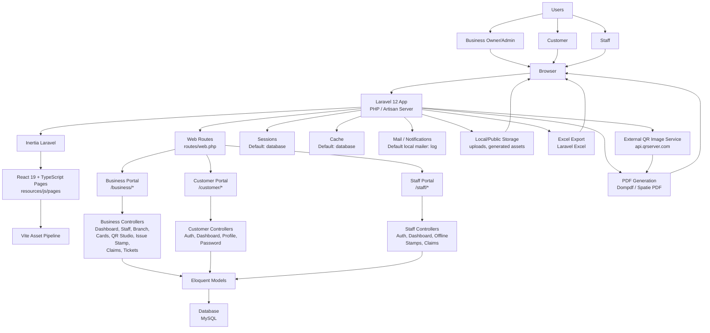

# StampBayan System Topology

This diagram shows the current StampBayan application topology based on the system parts currently used.

## Included Components

- **Users:** Business owners/admins, customers, and staff.
- **Browser:** Main access point for all portals.
- **Laravel Application:** Main backend runtime for routes, controllers, authentication, business logic, PDF generation, exports, storage, and notifications.
- **Inertia + React:** Frontend rendering layer used by the browser-facing pages.
- **Web Routes:** Main route layer used by the application.
- **Role-Based Portals:** Separate business, customer, and staff areas.
- **Eloquent Models:** Application data model layer.
- **Database:** Stores business, branch, user, customer, staff, loyalty card, stamp, perk, claim, ticket, session, and cache data.
- **Supporting Services:** Mail notifications, local/public storage, Excel exports, PDF generation, and QR image generation.

## Removed From This Diagram

- **API routes:** Removed because this topology is focused on the active browser-facing system flow.
- **JSON API / API Controllers:** Removed from the diagram as requested.
- **Queue Worker:** Removed because it is not currently used in the active system setup.
